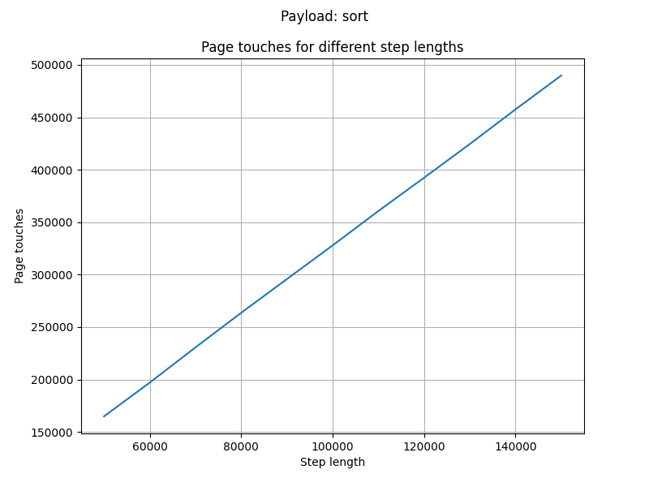

# Benchmark results

## Introduction

This benchmark measures the performance of the RISC Zero (risc0) virtual machine based on the step size of the Cartesi machine executed within it. For each step size, we measured the following metrics: risc0 execution time, number of segments used, total cycles, user cycles, and the number of pages used by the Cartesi machine. The measurements were performed for the Cartesi machine with hashing enabled and hashing disabled to evaluate the impact of hashing on performance.

We evaluated the following payloads:
- `sort`: sorting 100,000 numbers using quicksort;
- `archive`: compressing a 50 MB file using gzip.
- `stress-loop`: a stress-ng loop benchmark.
- `stress-int64`: a stress-ng int64 benchmark.
- `stress-fp`: a stress-ng floating point benchmark.

## Test setup

- *Cartesi machine start mcycle*: `60,000,000` (an empty machine takes `42,051,629` mcycles to boot and halt).
- *Minimum measured Cartesi machine step size*: `50,000`
- *Maximum measured Cartesi machine step size*: `160,000`
- *Cartesi machine step size increment during measurements*: `10,000`
- *Log size at maximum Cartesi machine step size*: `1.6 MB`
- *Page size*: `4 KB`

## Results

### Sort

**risc0 metrics**

> Cartesi machine hashing is enabled on the left and disabled on the right.

  
  

**Cartesi metrics**

  
  

### Archive

**risc0 metrics**

> Cartesi machine hashing is enabled on the left and disabled on the right.

  
  

**Cartesi metrics**

  
  

### stress-loop

**risc0 metrics**

> Cartesi machine hashing is enabled on the left and disabled on the right.

  
  

**Cartesi metrics**

  
  

### stress-int64

**risc0 metrics**

> Cartesi machine hashing is enabled on the left and disabled on the right.

  
  

**Cartesi metrics**

  
  

### stress-fp

**risc0 metrics**

> Cartesi machine hashing is enabled on the left and disabled on the right.

  
  

**Cartesi metrics**

  
  

## Raw data

  
`sort` with hashing, metrics

  Execution Times: [24.40800225, 25.026591083, 25.52599125, 26.060533917, 26.940070958, 27.620274584, 27.911508291, 28.502488541, 28.871570667, 29.506068792, 30.088930791]
  Number of Segments: [1213, 1239, 1263, 1288, 1313, 1338, 1363, 1388, 1413, 1438, 1463]
  Total Cycles: [1271922688, 1298268160, 1324351488, 1350565888, 1376780288, 1402994688, 1429209088, 1454899200, 1481113600, 1507065856, 1533280256]
  User Cycles: [1203167107, 1226975354, 1250971773, 1274840140, 1298495028, 1322132204, 1345938345, 1369497504, 1393165231, 1417033128, 1440707744]

  
`sort` with hashing, pages

  [(50000, 77), (60000, 77), (70000, 77), (80000, 77), (90000, 77), (100000, 77), (110000, 77), (120000, 77), (130000, 77), (140000, 77), (150000, 77)]

  
`sort` with hashing, memory

  [(50000, Counter({'touch_page': 164861, 'read shadow': 72609, 'write shadow': 31347, 'read memory': 10007, 'write memory': 6477, 'flush tlb': 2304, 'read pma': 173, 'translate vaddr': 67, 'replace tlb': 54})), (60000, Counter({'touch_page': 197049, 'read shadow': 87006, 'write shadow': 37817, 'read memory': 11858, 'write memory': 7919, 'flush tlb': 2304, 'read pma': 173, 'translate vaddr': 67, 'replace tlb': 54})), (70000, Counter({'touch_page': 230602, 'read shadow': 102004, 'write shadow': 43632, 'read memory': 13950, 'write memory': 9535, 'flush tlb': 2304, 'read pma': 173, 'translate vaddr': 67, 'replace tlb': 54})), (80000, Counter({'touch_page': 263610, 'read shadow': 116926, 'write shadow': 49492, 'read memory': 16024, 'write memory': 11036, 'flush tlb': 2304, 'read pma': 173, 'translate vaddr': 67, 'replace tlb': 54})), (90000, Counter({'touch_page': 295779, 'read shadow': 131471, 'write shadow': 55814, 'read memory': 17926, 'write memory': 12435, 'flush tlb': 2304, 'read pma': 173, 'translate vaddr': 67, 'replace tlb': 54})), (100000, Counter({'touch_page': 327871, 'read shadow': 145822, 'write shadow': 62355, 'read memory': 19774, 'write memory': 13849, 'flush tlb': 2304, 'read pma': 173, 'translate vaddr': 67, 'replace tlb': 54})), (110000, Counter({'touch_page': 360655, 'read shadow': 160499, 'write shadow': 68515, 'read memory': 21751, 'write memory': 15353, 'flush tlb': 2304, 'read pma': 173, 'translate vaddr': 67, 'replace tlb': 54})), (120000, Counter({'touch_page': 392385, 'read shadow': 174916, 'write shadow': 74929, 'read memory': 23624, 'write memory': 16673, 'flush tlb': 2304, 'read pma': 173, 'translate vaddr': 67, 'replace tlb': 54})), (130000, Counter({'touch_page': 424535, 'read shadow': 189317, 'write shadow': 81351, 'read memory': 25517, 'write memory': 18085, 'flush tlb': 2304, 'read pma': 173, 'translate vaddr': 67, 'replace tlb': 54})), (140000, Counter({'touch_page': 457554, 'read shadow': 204092, 'write shadow': 87405, 'read memory': 27519, 'write memory': 19631, 'flush tlb': 2304, 'read pma': 173, 'translate vaddr': 67, 'replace tlb': 54})), (150000, Counter({'touch_page': 489869, 'read shadow': 218504, 'write shadow': 93905, 'read memory': 29368, 'write memory': 21095, 'flush tlb': 2304, 'read pma': 173, 'translate vaddr': 67, 'replace tlb': 54}))]

  
`archive` with hashing, metrics

  Execution Times: [27.688293583, 28.012971917, 28.845702625, 29.770802875, 30.685631541, 31.765195875, 31.868262375, 32.5664795, 32.985951584, 33.612534583, 33.948183084]
  Number of Segments: [1368, 1394, 1432, 1458, 1483, 1508, 1533, 1570, 1613, 1638, 1663]
  Total Cycles: [1434451968, 1460928512, 1501560832, 1528299520, 1554513920, 1581252608, 1607467008, 1646264320, 1690566656, 1716781056, 1743781888]
  User Cycles: [1356288424, 1380402286, 1417727682, 1441735190, 1465304163, 1489080960, 1512878678, 1548992276, 1588665658, 1612243220, 1636288957]

  
`archive` with hashing, pages

  [(50000, 88), (60000, 88), (70000, 89), (80000, 89), (90000, 89), (100000, 89), (110000, 89), (120000, 90), (130000, 91), (140000, 91), (150000, 91)]

  
`archive` with hashing, memory

  [(50000, Counter({'touch_page': 157754, 'read shadow': 70788, 'write shadow': 41796, 'read memory': 8037, 'write memory': 3964, 'flush tlb': 2304, 'read pma': 220, 'translate vaddr': 137, 'replace tlb': 66})), (60000, Counter({'touch_page': 188523, 'read shadow': 84843, 'write shadow': 50057, 'read memory': 9848, 'write memory': 4704, 'flush tlb': 2304, 'read pma': 220, 'translate vaddr': 157, 'replace tlb': 66})), (70000, Counter({'touch_page': 218488, 'read shadow': 99051, 'write shadow': 58534, 'read memory': 11190, 'write memory': 5510, 'flush tlb': 2304, 'read pma': 224, 'translate vaddr': 167, 'replace tlb': 67})), (80000, Counter({'touch_page': 249251, 'read shadow': 113109, 'write shadow': 66797, 'read memory': 13000, 'write memory': 6248, 'flush tlb': 2304, 'read pma': 224, 'translate vaddr': 187, 'replace tlb': 67})), (90000, Counter({'touch_page': 279198, 'read shadow': 127315, 'write shadow': 75276, 'read memory': 14340, 'write memory': 7051, 'flush tlb': 2304, 'read pma': 224, 'translate vaddr': 197, 'replace tlb': 67})), (100000, Counter({'touch_page': 309532, 'read shadow': 141458, 'write shadow': 83654, 'read memory': 15898, 'write memory': 7826, 'flush tlb': 2304, 'read pma': 224, 'translate vaddr': 210, 'replace tlb': 67})), (110000, Counter({'touch_page': 339904, 'read shadow': 155578, 'write shadow': 92018, 'read memory': 17489, 'write memory': 8592, 'flush tlb': 2304, 'translate vaddr': 227, 'read pma': 224, 'replace tlb': 67})), (120000, Counter({'touch_page': 369877, 'read shadow': 169781, 'write shadow': 100494, 'read memory': 18833, 'write memory': 9400, 'flush tlb': 2304, 'translate vaddr': 237, 'read pma': 228, 'replace tlb': 68})), (130000, Counter({'touch_page': 400657, 'read shadow': 183846, 'write shadow': 108756, 'read memory': 20646, 'write memory': 10138, 'flush tlb': 2304, 'translate vaddr': 257, 'read pma': 232, 'replace tlb': 69})), (140000, Counter({'touch_page': 430603, 'read shadow': 198050, 'write shadow': 117236, 'read memory': 21986, 'write memory': 10941, 'flush tlb': 2304, 'translate vaddr': 267, 'read pma': 232, 'replace tlb': 69})), (150000, Counter({'touch_page': 461366, 'read shadow': 212109, 'write shadow': 125498, 'read memory': 23796, 'write memory': 11679, 'flush tlb': 2304, 'translate vaddr': 287, 'read pma': 232, 'replace tlb': 69}))]

  
`stress-loop` with hashing, metrics

  Execution Times: [59.823801667, 64.917657875, 68.254624666, 82.7117275, 91.909244792, 94.041541042, 95.812312667, 97.933236042, 100.387099833, 101.773493417, 104.3847305]
  Number of Segments: [2988, 3232, 3421, 4160, 4624, 4735, 4832, 4936, 5057, 5137, 5261]
  Total Cycles: [3132162048, 3388997632, 3586260992, 4362076160, 4848091136, 4964483072, 5066719232, 5175771136, 5302124544, 5386534912, 5516558336]
  User Cycles: [2959721419, 3200696602, 3385732634, 4102352093, 4557559224, 4661614808, 4751118801, 4851735009, 4965362580, 5039497478, 5157040769]

  
`stress-loop` with hashing, pages

  [(50000, 200), (60000, 215), (70000, 226), (80000, 273), (90000, 303), (100000, 308), (110000, 312), (120000, 317), (130000, 322), (140000, 325), (150000, 331)]

  
`stress-loop` with hashing, memory

  [(50000, Counter({'touch_page': 220500, 'read shadow': 72840, 'write shadow': 28732, 'write memory': 16540, 'read memory': 15294, 'flush tlb': 1536, 'translate vaddr': 1088, 'read pma': 690, 'replace tlb': 211})), (60000, Counter({'touch_page': 270405, 'read shadow': 87573, 'write shadow': 34159, 'write memory': 20693, 'read memory': 19626, 'flush tlb': 1536, 'translate vaddr': 1120, 'read pma': 760, 'replace tlb': 226})), (70000, Counter({'touch_page': 318134, 'read shadow': 102113, 'write shadow': 39716, 'write memory': 24465, 'read memory': 23682, 'flush tlb': 1536, 'translate vaddr': 1228, 'read pma': 822, 'replace tlb': 240})), (80000, Counter({'touch_page': 384283, 'read shadow': 116823, 'write shadow': 46777, 'read memory': 27767, 'write memory': 25946, 'flush tlb': 13056, 'read pma': 2818, 'translate vaddr': 1797, 'replace tlb': 840})), (90000, Counter({'touch_page': 448710, 'read shadow': 133196, 'write shadow': 51500, 'write memory': 30207, 'read memory': 30120, 'flush tlb': 21760, 'read pma': 3828, 'translate vaddr': 2144, 'replace tlb': 1139})), (100000, Counter({'touch_page': 493793, 'read shadow': 148056, 'write shadow': 57341, 'write memory': 33157, 'read memory': 32291, 'flush tlb': 24064, 'read pma': 4301, 'translate vaddr': 2508, 'replace tlb': 1287})), (110000, Counter({'touch_page': 533345, 'read shadow': 162539, 'write shadow': 62864, 'write memory': 36439, 'read memory': 34064, 'flush tlb': 24064, 'read pma': 4317, 'translate vaddr': 2874, 'replace tlb': 1292})), (120000, Counter({'touch_page': 574267, 'read shadow': 177581, 'write shadow': 67954, 'write memory': 40218, 'read memory': 35631, 'flush tlb': 24064, 'read pma': 4333, 'translate vaddr': 3198, 'replace tlb': 1297})), (130000, Counter({'touch_page': 615231, 'read shadow': 192636, 'write shadow': 73029, 'write memory': 44006, 'read memory': 37196, 'flush tlb': 24064, 'read pma': 4357, 'translate vaddr': 3526, 'replace tlb': 1304})), (140000, Counter({'touch_page': 653418, 'read shadow': 206710, 'write shadow': 78952, 'write memory': 46854, 'read memory': 39075, 'flush tlb': 24064, 'read pma': 4366, 'translate vaddr': 3913, 'replace tlb': 1307})), (150000, Counter({'touch_page': 694471, 'read shadow': 221803, 'write shadow': 83992, 'write memory': 50695, 'read memory': 40609, 'flush tlb': 24064, 'read pma': 4384, 'translate vaddr': 4231, 'replace tlb': 1313}))]

  
`stress-int64` with hashing, metrics

  Execution Times: [59.784809792, 64.613296292, 67.856245708, 82.61569025, 92.175856625, 94.856283292, 95.945892625, 97.961629208, 100.971925416, 102.357587417, 104.633275292]
  Number of Segments: [2987, 3218, 3394, 4160, 4624, 4735, 4833, 4937, 5057, 5137, 5247]
  Total Cycles: [3132096512, 3374317568, 3558866944, 4362076160, 4848615424, 4965007360, 5066981376, 5176033280, 5302124544, 5386534912, 5501878272]
  User Cycles: [2959547330, 3186696333, 3358849830, 4102580526, 4557653509, 4661842940, 4751352431, 4851953257, 4965584253, 5039715298, 5143343987]

  
`stress-int64` with hashing, pages

  [(50000, 200), (60000, 214), (70000, 224), (80000, 273), (90000, 303), (100000, 308), (110000, 312), (120000, 317), (130000, 322), (140000, 325), (150000, 330)]

  
`stress-int64` with hashing, memory

  [(50000, Counter({'touch_page': 220179, 'read shadow': 72814, 'write shadow': 28757, 'write memory': 16490, 'read memory': 15242, 'flush tlb': 1536, 'translate vaddr': 1100, 'read pma': 690, 'replace tlb': 211})), (60000, Counter({'touch_page': 270228, 'read shadow': 87559, 'write shadow': 34162, 'write memory': 20673, 'read memory': 19588, 'flush tlb': 1536, 'translate vaddr': 1131, 'read pma': 754, 'replace tlb': 225})
), (70000, Counter({'touch_page': 318140, 'read shadow': 102124, 'write shadow': 39705, 'write memory': 24479, 'read memory': 23662, 'flush tlb': 1536, 'translate vaddr': 1234, 'read pma': 813, 'replace tlb': 237})), (80000, Counter({'touch_page': 384296, 'read shadow': 116842, 'write shadow': 46762, 'read memory': 27747, 'write memory': 25964, 'flush tlb': 13056, 'read pma': 2818, 'translate vaddr': 1796, 'replace tlb': 840})), (90000, Counter({'touch_page': 448322, 'read shadow': 133095, 'write shadow': 51599, 'read memory': 30143, 'write memory': 30089, 'flush tlb': 21760, 'read pma': 3819, 'translate vaddr': 2153, 'replace tlb': 1136})), (100000, Counter({'touch_page': 493829, 'read shadow': 148075, 'write shadow': 57323, 'write memory': 33174, 'read memory': 32278, 'flush tlb': 24064, 'read pma': 4301, 'translate vaddr': 2510, 'rep
lace tlb': 1287})), (110000, Counter({'touch_page': 533422, 'read shadow': 162566, 'write shadow': 62833, 'write memory': 36472, 'read memory': 34041, 'flush tlb': 24064, 'read pma': 4317, 'translate vaddr': 2880, 'replace tlb': 1292})), (120000, Counter({'touch_page': 574292, 'read shadow': 177612, 'write shadow': 67927, 'write memory': 40245, 'read memory': 35601, 'flush tlb': 24064, 'read pma': 4333, 'translate vaddr': 3199, 'replace tlb': 1297})), (130000, Counter({'touch_page': 615248, 'read shadow': 192650, 'write shadow': 73016, 'write memory': 44025, 'read memory': 37176, 'flush tlb': 24064, 'read pma': 4357, 'translate vaddr': 3526, 'replace tlb': 1304})), (140000, Counter({'touch_page': 653428, 'read shadow': 206701, 'write shadow': 78941, 'write memory': 46860, 'read memory': 39070, 'flush tlb': 24064, 'read pma': 4366, 'translate vaddr': 3920, 'replace tlb': 1307})), (150000, Counter({'touch_page': 694370, 'read shadow': 221768, 'write shadow': 84020, 'write memory': 50658, 'read memory': 40619, 'flush tlb': 24064, 'read pma': 4381, 'translate vaddr': 4239, 'replace tlb': 1312}))]

  
`stress-fp` with hashing, metrics

  Execution Times: [59.579221041, 64.709322542, 69.335317917, 82.706369292, 91.994851042, 94.1272425, 96.252901958, 98.500104917, 101.194926209, 102.166719833, 104.606742834]
  Number of Segments: [2987, 3232, 3477, 4160, 4624, 4735, 4832, 4936, 5071, 5153, 5261]
  Total Cycles: [3132096512, 3388997632, 3645374464, 4362076160, 4848615424, 4965007360, 5066719232, 5175771136, 5316411392, 5402787840, 5516558336]
  User Cycles: [2959832749, 3200804513, 3441597326, 4102573980, 4557882755, 4661785317, 4751306776, 4851921152, 4979389220, 5054503219, 5157426314]

  
`stress-fp` with hashing, pages

  [(50000, 200), (60000, 215), (70000, 230), (80000, 273), (90000, 303), (100000, 308), (110000, 312), (120000, 317), (130000, 323), (140000, 326), (150000, 331)]

  
`stress-fp` with hashing, memory

  [(50000, Counter({'touch_page': 220954, 'read shadow': 72834, 'write shadow': 28725, 'write memory': 16572, 'read memory': 15415, 'flush tlb': 1536, 'translate vaddr': 1080, 'read pma': 690, 'replace tlb': 211})), (60000, Counter({'touch_page': 270867, 'read shadow': 87571, 'write shadow': 34148, 'write memory': 20730, 'read memory': 19743, 'flush tlb': 1536, 'translate vaddr': 1112, 'read pma': 760, 'replace tlb': 226})), (70000, Counter({'touch_page': 318280, 'read shadow': 102049, 'write shadow': 39795, 'write memory': 24368, 'read memory': 23825, 'flush tlb': 1536, 'translate vaddr': 1248, 'read pma': 849, 'replace tlb': 249})), (80000, Counter({'touch_page': 384255, 'read shadow': 116772, 'write shadow': 46822, 'read memory': 27852, 'write memory': 25866, 'flush tlb': 13056, 'read pma': 2821, 'translate vaddr': 1810, 'replace tlb': 841})), (90000, Counter({'touch_page': 448840, 'read shadow': 133190, 'write shadow': 51568, 'read memory': 30215, 'write memory': 30124, 'flush tlb': 21760, 'read pma': 3900, 'translate vaddr': 2163, 'replace tlb': 1163})), (100000, Counter({'touch_page': 493599, 'read shadow': 147969, 'write shadow': 57412, 'write memory': 33078, 'read memory': 32327, 'flush tlb': 24064, 'read pma': 4301, 'translate vaddr': 2518, 'replace tlb': 1287})), (110000, Counter({'touch_page': 533208, 'read shadow': 162475, 'write shadow': 62911, 'write memory': 36373, 'read memory': 34099, 'flush tlb': 24064, 'read pma': 4317, 'translate vaddr': 2887, 'replace tlb': 1292})), (120000, Counter({'touch_page': 574150, 'read shadow': 177540, 'write shadow': 67987, 'write memory': 40172, 'read memory': 35646, 'flush tlb': 24064, 'read pma': 4333, 'translate vaddr': 3208, 'replace tlb': 1297})), (130000, Counter({'touch_page': 615104, 'read shadow': 192603, 'write shadow': 73063, 'write memory': 43968, 'read memory': 37201, 'flush tlb': 24064, 'read pma': 4360, 'translate vaddr': 3529, 'replace tlb': 1305})), (140000, Counter({'touch_page': 653954, 'read shadow': 206848, 'write shadow': 78803, 'write memory': 47026, 'read memory': 39035, 'flush tlb': 24064, 'read pma': 4369, 'translate vaddr': 3906, 'replace tlb': 1308})), (150000, Counter({'touch_page': 695139, 'read shadow': 221974, 'write shadow': 83808, 'write memory': 50905, 'read memory': 40564, 'flush tlb': 24064, 'read pma': 4384, 'translate vaddr': 4223, 'replace tlb': 1313}))]

  
`sort` without hashing, metrics

  Execution Times: [4.116110958, 4.795842917, 5.25442475, 5.836159125, 6.714678416, 6.972458625, 7.541030542, 8.103924458, 8.693531667, 9.280503583, 9.850527]
  Number of Segments: [153, 178, 202, 227, 252, 277, 302, 327, 352, 377, 401]
  Total Cycles: [159449088, 185729024, 211812352, 238026752, 264241152, 290455552, 316145664, 342097920, 368312320, 394330112, 420478976]
  User Cycles: [144795148, 168603395, 192599814, 216468181, 240123069, 263760245, 287566386, 311125545, 334793272, 358661169, 382335785]

  
`sort` without hashing, pages

  [(50000, 77), (60000, 77), (70000, 77), (80000, 77), (90000, 77), (100000, 77), (110000, 77), (120000, 77), (130000, 77), (140000, 77), (150000, 77)]

  
`archive` without hashing, metrics

  Execution Times: [4.445975875, 5.0563435, 5.8641285, 6.344612417, 6.644023125, 7.230039667, 7.78878725, 8.310911375, 9.048822458, 9.622858333, 10.206426417]
  Number of Segments: [157, 183, 208, 234, 259, 284, 309, 333, 362, 387, 412]
  Total Cycles: [164626432, 191889408, 218103808, 244449280, 270663680, 297271296, 324009984, 348258304, 378798080, 405012480, 432013312]
  User Cycles: [148108092, 172221954, 195884487, 219891995, 243460968, 267237765, 291035483, 313647258, 339711457, 363289019, 387334756]

  
`archive` without hashing, pages

  [(50000, 97), (60000, 179), (70000, 273), (80000, 316), (90000, 372), (100000, 372), (110000, 380), (120000, 387), (130000, 395), (140000, 396), (150000, 407)]

  
`stress-loop` without hashing, metrics

  Execution Times: [6.844295417, 7.8594625, 8.765140083, 10.860310458, 12.083854792, 12.99840525, 14.048733542, 14.651155084, 15.7652835, 16.580864583, 17.534310542]
  Number of Segments: [242, 283, 322, 416, 470, 512, 555, 591, 645, 684, 726]
  Total Cycles: [252968960, 296222720, 336855040, 435224576, 492044288, 536870912, 581959680, 619708416, 675414016, 717225984, 761266176]
  User Cycles: [220012899, 257816577, 293634716, 369602654, 416104855, 452114524, 487450185, 520342558, 566246294, 599661003, 635978636]

  
`stress-loop` without hashing, pages

  [(50000, 200), (60000, 215), (70000, 226), (80000, 273), (90000, 303), (100000, 308), (110000, 312), (120000, 317), (130000, 322), (140000, 325), (150000, 331)]

  
`stress-int64` without hashing, metrics

  Execution Times: [7.225619167, 7.931633083, 8.775219834, 10.978940542, 12.176284209, 13.009211791, 13.9912865, 14.692022125, 15.804183375, 16.549565167, 17.474033708]
  Number of Segments: [242, 282, 323, 416, 470, 513, 555, 591, 645, 684, 725]
  Total Cycles: [252968960, 295698432, 338165760, 435421184, 491913216, 537001984, 581959680, 619708416, 675807232, 717225984, 760217600]
  User Cycles: [219892490, 257425491, 294131318, 369616367, 415984420, 452127936, 487469095, 520346086, 566253247, 599664103, 635568957]

  
`stress-int64` without hashing, pages

  [(50000, 200), (60000, 214), (70000, 224), (80000, 273), (90000, 303), (100000, 308), (110000, 312), (120000, 317), (130000, 322), (140000, 325), (150000, 330)]

  
`stress-fp` without hashing, metrics

  Execution Times: [6.857303958, 7.869118625, 8.826099792, 10.847246042, 12.111128, 13.002567667, 13.870791042, 14.659953583, 15.783684208, 16.582118958, 17.589230542]
  Number of Segments: [242, 283, 323, 416, 470, 512, 555, 591, 645, 686, 726]
  Total Cycles: [253231104, 296747008, 338165760, 435421184, 492830720, 536870912, 581959680, 619708416, 675545088, 718798848, 761266176]
  User Cycles: [220177909, 257978168, 295008996, 369609821, 416213666, 452070313, 487423440, 520313981, 566556391, 600896521, 636149461]

  
`stress-fp` without hashing, pages

  [(50000, 200), (60000, 215), (70000, 230), (80000, 273), (90000, 303), (100000, 308), (110000, 312), (120000, 317), (130000, 323), (140000, 326), (150000, 331)]

