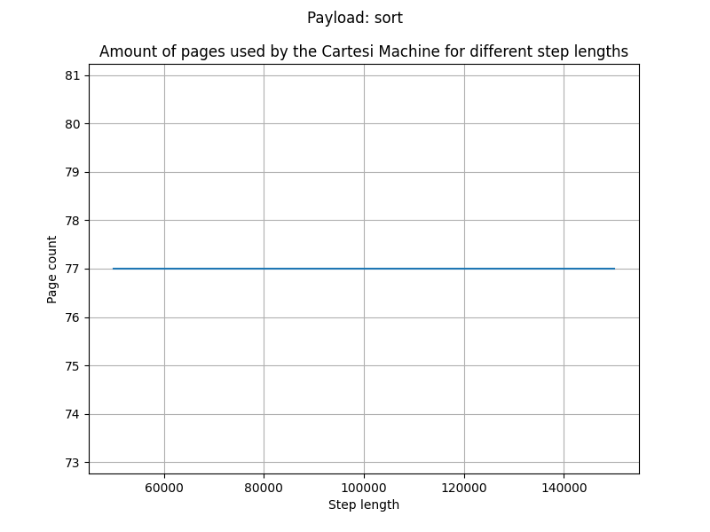
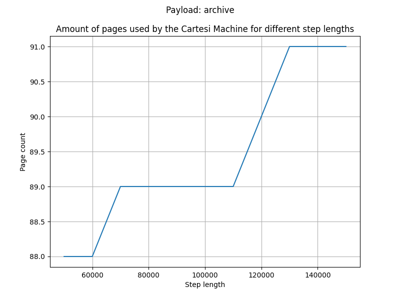

# Benchmark results

## Introduction

This benchmark measures the performance of the RISC Zero (risc0) virtual machine based on the step size of the Cartesi machine executed within it. For each step size, we measured the following metrics: risc0 execution time, number of segments used, total cycles, user cycles, and the number of pages used by the Cartesi machine. The measurements were performed for the Cartesi machine with hashing enabled and hashing disabled to evaluate the impact of hashing on performance.

We evaluated two payloads: `sort` and `archive`:
- `sort`: sorting 100,000 numbers using quicksort;
- `archive`: compressing a 50 MB file using gzip.

## Test setup

- *Cartesi machine start mcycle*: `42,000,000` (an empty machine takes `42,051,629` mcycles to boot and halt).
- *Minimum measured Cartesi machine step size*: `50,000`
- *Maximum measured Cartesi machine step size*: `160,000`
- *Cartesi machine step size increment during measurements*: `10,000`
- *Log size at maximum Cartesi machine step size*: `1.6 MB`
- *Page size*: `4 KB`

## Results

### Sort

> Hashing is enabled on the left and disabled on the right.

  
  

  
  

*Page data density*

  
  
  

### Archive

> Hashing is enabled on the left and disabled on the right.

  
  

  
  

*Page data density*

  
  
  

## Raw data

  
`sort` with hashing, metrics

  Execution Times: [30.396731042, 54.497579958, 81.666974875, 94.049946208, 110.125275375, 111.517550875, 114.515082709, 116.965219833, 120.923910583, 120.852835, 125.695607209]
  Number of Segments: [1510, 2714, 4101, 4749, 5579, 5613, 5763, 5892, 6049, 6100, 6295]
  Total Cycles: [1582432256, 2845835264, 4299423744, 4979687424, 5850005504, 5885132800, 6042419200, 6177685504, 6342049792, 6396313600, 6600261632]
  User Cycles: [1487883270, 2680800955, 4043483269, 4680945034, 5499757647, 5529699421, 5674965705, 5799511182, 5947020930, 5993647936, 6182097515]

  
`sort` with hashing, pages

  [(50000, 97), (60000, 179), (70000, 273), (80000, 316), (90000, 372), (100000, 372), (110000, 380), (120000, 387), (130000, 395), (140000, 396), (150000, 407)]

  
`archive` with hashing, metrics

  Execution Times: [30.314777708, 54.183975542, 81.851137834, 93.968907792, 110.929307125, 112.282578833, 114.084678583, 117.629107709, 119.786220833, 122.010570417, 125.942048625]
  Number of Segments: [1510, 2714, 4101, 4749, 5579, 5613, 5763, 5892, 6049, 6100, 6295]
  Total Cycles: [1582432256, 2845835264, 4299423744, 4979687424, 5850005504, 5885132800, 6042419200, 6177685504, 6342049792, 6396313600, 6600261632]
  User Cycles: [1487883270, 2680800955, 4043483269, 4680945034, 5499757647, 5529699421, 5674965705, 5799511182, 5947020930, 5993647936, 6182097515]

  
`archive` with hashing, pages

  [(50000, 97), (60000, 179), (70000, 273), (80000, 316), (90000, 372), (100000, 372), (110000, 380), (120000, 387), (130000, 395), (140000, 396), (150000, 407)]

  
`sort` without hashing, metrics

  Execution Times: [4.607259542, 6.999926792, 9.53582725, 11.0995075, 12.965277458, 13.756316417, 14.759286542, 15.209169375, 16.160875542, 16.935132458, 17.843436416]
  Number of Segments: [175, 257, 358, 419, 484, 518, 560, 593, 640, 679, 724]
  Total Cycles: [183500800, 268697600, 374603776, 438829056, 507510784, 543162368, 586416128, 621019136, 670564352, 711196672, 758644736]
  User Cycles: [156361411, 228119130, 311162482, 362677858, 420020383, 449962157, 486730737, 516119293, 555077657, 588149160, 627166126]

  
`sort` without hashing, pages

  [(50000, 97), (60000, 179), (70000, 273), (80000, 316), (90000, 372), (100000, 372), (110000, 380), (120000, 387), (130000, 395), (140000, 396), (150000, 407)]

  
`archive` without hashing, metrics

  Execution Times: [4.573618083, 6.935762375, 9.639705833, 11.358891667, 12.986429083, 13.483717292, 14.434519209, 15.132224583, 16.15796575, 17.027803042, 17.875225791]
  Number of Segments: [175, 257, 358, 419, 484, 518, 560, 593, 640, 679, 724]
  Total Cycles: [183500800, 268697600, 374603776, 438829056, 507510784, 543162368, 586416128, 621019136, 670564352, 711196672, 758644736]
  User Cycles: [156361411, 228119130, 311162482, 362677858, 420020383, 449962157, 486730737, 516119293, 555077657, 588149160, 627166126]

  
`archive` without hashing, pages

  [(50000, 97), (60000, 179), (70000, 273), (80000, 316), (90000, 372), (100000, 372), (110000, 380), (120000, 387), (130000, 395), (140000, 396), (150000, 407)]

  
 `sort` page data density

  [5.224609375, 1.26953125, 47.900390625, 48.53515625, 48.9990234375, 19.3115234375, 19.1650390625, 18.2861328125, 1.3916015625, 82.421875, 93.3349609375, 92.4560546875, 95.4345703125, 95.01953125, 93.994140625, 92.87109375, 86.962890625, 89.55078125, 31.787109375, 2.3193359375, 0.244140625, 4.296875, 9.1064453125, 0.6591796875, 35.400390625, 10.3759765625, 9.033203125, 23.681640625, 70.9716796875, 88.57421875, 86.23046875, 78.955078125, 85.693359375, 83.935546875, 87.3779296875, 87.2314453125, 89.55078125, 87.646484375, 89.013671875, 88.6474609375, 86.1083984375, 87.1337890625, 87.59765625, 88.37890625, 88.1103515625, 89.2578125, 89.111328125, 87.646484375, 85.2783203125, 84.228515625, 85.4248046875, 86.8896484375, 87.548828125, 85.4736328125, 85.83984375, 86.083984375, 88.1103515625, 86.7431640625, 86.7431640625, 88.76953125, 90.9423828125, 90.673828125, 87.060546875, 87.0849609375, 83.3984375, 85.546875, 85.9130859375, 86.7431640625, 85.83984375, 87.4267578125, 87.939453125, 86.23046875, 84.716796875, 86.1083984375, 86.962890625, 86.03515625, 86.81640625, 89.5263671875, 89.3798828125, 88.5986328125, 87.4267578125, 89.208984375, 86.083984375, 86.572265625, 88.5498046875, 88.037109375, 88.2568359375, 87.4755859375, 87.3291015625, 88.5986328125, 86.42578125, 88.037109375, 87.3779296875, 88.3544921875, 88.96484375, 87.20703125, 76.806640625, 85.7421875, 89.0380859375, 85.4736328125, 85.9130859375, 86.1083984375, 85.3271484375, 86.4013671875, 86.3037109375, 86.03515625, 86.5234375, 86.1328125, 87.01171875, 86.9384765625, 88.0126953125, 88.1591796875, 87.0361328125, 87.79296875, 87.9638671875, 87.98828125, 85.9130859375, 87.8173828125, 87.2314453125, 87.8662109375, 86.6455078125, 86.767578125, 87.8662109375, 89.208984375, 87.40234375, 87.1337890625, 85.83984375, 86.03515625, 86.865234375, 86.4013671875, 87.2314453125, 85.8154296875, 87.6220703125, 86.181640625, 87.3046875, 86.279296875, 88.3056640625, 87.6220703125, 85.9130859375, 85.498046875, 88.330078125, 87.01171875, 86.3037109375, 87.6953125, 87.59765625, 85.1318359375, 87.4755859375, 86.5234375, 87.4755859375, 87.9150390625, 87.4755859375, 85.9619140625, 87.3779296875, 86.962890625, 87.59765625, 87.0849609375, 87.40234375, 86.865234375, 88.037109375, 89.0625, 85.107421875, 88.3544921875, 88.76953125, 86.7431640625, 86.865234375, 87.6953125, 86.474609375, 88.6962890625, 88.1103515625, 88.3056640625, 87.8173828125, 86.572265625, 87.3046875, 87.6708984375, 86.5234375, 87.7197265625, 87.9638671875, 88.134765625, 87.0361328125, 87.7685546875, 87.548828125, 86.5478515625, 83.7646484375, 84.7412109375, 88.4033203125, 86.0107421875, 88.671875, 87.2314453125, 87.0849609375, 84.716796875, 84.0087890625, 85.400390625, 86.669921875, 87.8173828125, 87.2802734375, 86.3037109375, 86.1083984375, 87.109375, 86.71875, 88.1591796875, 88.5498046875, 88.8916015625, 87.2802734375, 87.59765625, 84.27734375, 84.86328125, 83.349609375, 84.814453125, 84.814453125, 85.6201171875, 86.962890625, 88.3544921875, 87.7197265625, 55.2490234375, 23.193359375, 23.486328125, 87.2802734375, 94.2138671875, 93.45703125, 93.6279296875, 92.96875, 93.9697265625, 92.5537109375, 93.359375, 95.01953125, 90.6494140625, 88.037109375, 69.53125, 74.4140625, 26.3427734375, 18.8232421875, 10.595703125, 66.6748046875, 89.990234375, 95.6787109375, 95.5322265625, 98.779296875, 94.3359375, 93.798828125, 92.1142578125, 93.84765625, 93.7255859375, 92.7978515625, 93.6279296875, 93.5791015625, 44.9462890625, 69.4580078125, 70.3369140625, 33.4716796875, 17.919921875, 14.306640625, 53.125, 93.84765625, 61.0595703125, 35.83984375, 56.884765625, 67.919921875, 53.466796875, 50.9521484375, 79.39453125, 51.123046875, 44.921875, 35.4248046875, 31.54296875, 18.798828125, 32.2021484375, 39.501953125, 83.251953125, 69.677734375, 70.4345703125, 20.5322265625, 12.060546875, 74.072265625, 64.0380859375, 24.1943359375, 3.173828125, 9.7412109375, 21.0205078125, 31.3232421875, 36.5966796875, 53.6376953125, 21.337890625, 8.9111328125, 28.759765625, 32.3486328125, 15.5517578125, 14.1845703125, 21.58203125, 44.8486328125, 34.08203125, 24.9267578125, 37.939453125, 22.998046875, 30.029296875, 48.33984375, 49.755859375, 48.3154296875, 29.6630859375, 67.724609375, 39.2822265625, 33.0322265625, 7.080078125, 7.177734375, 2.7587890625, 4.78515625, 4.5654296875, 7.275390625, 11.1328125, 1.025390625, 6.34765625, 5.2978515625, 12.40234375, 51.220703125, 57.8857421875, 59.1796875, 24.560546875, 22.7783203125, 40.771484375, 27.34375, 18.06640625, 4.833984375, 4.00390625, 23.388671875, 21.435546875, 57.9345703125, 17.333984375, 19.5556640625, 5.712890625, 7.275390625, 42.7734375, 31.005859375, 31.005859375, 32.666015625, 34.3017578125, 29.9560546875, 27.2216796875, 26.0498046875, 30.3466796875, 32.03125, 20.947265625, 46.826171875, 24.90234375, 10.302734375, 23.583984375, 37.4267578125, 39.013671875, 4.1259765625, 17.919921875, 14.4287109375, 26.0009765625, 24.462890625, 4.00390625, 26.6357421875, 2.2216796875, 11.4990234375, 0.9521484375, 20.1416015625, 10.546875, 17.67578125, 9.033203125, 0.1708984375, 0.1708984375, 0.0732421875, 0.0732421875, 11.474609375, 32.2021484375, 3.564453125, 0.2685546875, 11.474609375, 5.5908203125, 0.0732421875, 20.7763671875, 8.251953125, 0.0732421875, 0.3662109375, 7.6416015625, 26.5380859375, 25.0244140625, 63.427734375, 51.318359375, 55.17578125, 47.9248046875, 33.935546875, 37.9638671875, 38.2080078125, 2.734375, 1.6357421875, 9.08203125, 31.6162109375, 32.373046875, 55.2978515625, 34.7900390625, 57.5927734375, 58.1298828125, 56.8359375, 57.2021484375, 57.8369140625, 37.255859375, 32.6171875, 27.3681640625, 17.3828125, 27.6611328125, 29.6630859375, 25.5859375, 27.1484375, 25.7080078125, 31.7138671875, 30.6884765625, 43.994140625, 38.330078125]

  
 `archive` page data density

  [5.224609375, 1.26953125, 47.900390625, 48.53515625, 48.9990234375, 19.3115234375, 19.1650390625, 18.2861328125, 1.3916015625, 82.421875, 93.3349609375, 92.4560546875, 95.4345703125, 95.01953125, 93.994140625, 92.87109375, 86.962890625, 89.55078125, 31.787109375, 2.3193359375, 0.244140625, 4.296875, 9.1064453125, 0.6591796875, 35.400390625, 10.3759765625, 9.033203125, 23.681640625, 70.9716796875, 88.57421875, 86.23046875, 78.955078125, 85.693359375, 83.935546875, 87.3779296875, 87.2314453125, 89.55078125, 87.646484375, 89.013671875, 88.6474609375, 86.1083984375, 87.1337890625, 87.59765625, 88.37890625, 88.1103515625, 89.2578125, 89.111328125, 87.646484375, 85.2783203125, 84.228515625, 85.4248046875, 86.8896484375, 87.548828125, 85.4736328125, 85.83984375, 86.083984375, 88.1103515625, 86.7431640625, 86.7431640625, 88.76953125, 90.9423828125, 90.673828125, 87.060546875, 87.0849609375, 83.3984375, 85.546875, 85.9130859375, 86.7431640625, 85.83984375, 87.4267578125, 87.939453125, 86.23046875, 84.716796875, 86.1083984375, 86.962890625, 86.03515625, 86.81640625, 89.5263671875, 89.3798828125, 88.5986328125, 87.4267578125, 89.208984375, 86.083984375, 86.572265625, 88.5498046875, 88.037109375, 88.2568359375, 87.4755859375, 87.3291015625, 88.5986328125, 86.42578125, 88.037109375, 87.3779296875, 88.3544921875, 88.96484375, 87.20703125, 76.806640625, 85.7421875, 89.0380859375, 85.4736328125, 85.9130859375, 86.1083984375, 85.3271484375, 86.4013671875, 86.3037109375, 86.03515625, 86.5234375, 86.1328125, 87.01171875, 86.9384765625, 88.0126953125, 88.1591796875, 87.0361328125, 87.79296875, 87.9638671875, 87.98828125, 85.9130859375, 87.8173828125, 87.2314453125, 87.8662109375, 86.6455078125, 86.767578125, 87.8662109375, 89.208984375, 87.40234375, 87.1337890625, 85.83984375, 86.03515625, 86.865234375, 86.4013671875, 87.2314453125, 85.8154296875, 87.6220703125, 86.181640625, 87.3046875, 86.279296875, 88.3056640625, 87.6220703125, 85.9130859375, 85.498046875, 88.330078125, 87.01171875, 86.3037109375, 87.6953125, 87.59765625, 85.1318359375, 87.4755859375, 86.5234375, 87.4755859375, 87.9150390625, 87.4755859375, 85.9619140625, 87.3779296875, 86.962890625, 87.59765625, 87.0849609375, 87.40234375, 86.865234375, 88.037109375, 89.0625, 85.107421875, 88.3544921875, 88.76953125, 86.7431640625, 86.865234375, 87.6953125, 86.474609375, 88.6962890625, 88.1103515625, 88.3056640625, 87.8173828125, 86.572265625, 87.3046875, 87.6708984375, 86.5234375, 87.7197265625, 87.9638671875, 88.134765625, 87.0361328125, 87.7685546875, 87.548828125, 86.5478515625, 83.7646484375, 84.7412109375, 88.4033203125, 86.0107421875, 88.671875, 87.2314453125, 87.0849609375, 84.716796875, 84.0087890625, 85.400390625, 86.669921875, 87.8173828125, 87.2802734375, 86.3037109375, 86.1083984375, 87.109375, 86.71875, 88.1591796875, 88.5498046875, 88.8916015625, 87.2802734375, 87.59765625, 84.27734375, 84.86328125, 83.349609375, 84.814453125, 84.814453125, 85.6201171875, 86.962890625, 88.3544921875, 87.7197265625, 55.2490234375, 23.193359375, 23.486328125, 87.2802734375, 94.2138671875, 93.45703125, 93.6279296875, 92.96875, 93.9697265625, 92.5537109375, 93.359375, 95.01953125, 90.6494140625, 88.037109375, 69.53125, 74.4140625, 26.3427734375, 18.8232421875, 10.595703125, 66.6748046875, 89.990234375, 95.6787109375, 95.5322265625, 98.779296875, 94.3359375, 93.798828125, 92.1142578125, 93.84765625, 93.7255859375, 92.7978515625, 93.6279296875, 93.5791015625, 44.9462890625, 69.4580078125, 70.3369140625, 33.4716796875, 17.919921875, 14.306640625, 53.125, 93.84765625, 61.0595703125, 35.83984375, 56.884765625, 67.919921875, 53.466796875, 50.9521484375, 79.39453125, 51.123046875, 44.921875, 35.4248046875, 31.54296875, 18.798828125, 32.2021484375, 39.501953125, 83.251953125, 69.677734375, 70.4345703125, 20.5322265625, 12.060546875, 74.072265625, 64.0380859375, 24.1943359375, 3.173828125, 9.7412109375, 21.0205078125, 31.3232421875, 36.5966796875, 53.6376953125, 21.337890625, 8.9111328125, 28.759765625, 32.3486328125, 15.5517578125, 14.1845703125, 21.58203125, 44.8486328125, 34.08203125, 24.9267578125, 37.939453125, 22.998046875, 30.029296875, 48.33984375, 49.755859375, 48.3154296875, 29.6630859375, 67.724609375, 39.2822265625, 33.0322265625, 7.080078125, 7.177734375, 2.7587890625, 4.78515625, 4.5654296875, 7.275390625, 11.1328125, 1.025390625, 6.34765625, 5.2978515625, 12.40234375, 51.220703125, 57.8857421875, 59.1796875, 24.560546875, 22.7783203125, 40.771484375, 27.34375, 18.06640625, 4.833984375, 4.00390625, 23.388671875, 21.435546875, 57.9345703125, 17.333984375, 19.5556640625, 5.712890625, 7.275390625, 42.7734375, 31.005859375, 31.005859375, 32.666015625, 34.3017578125, 29.9560546875, 27.2216796875, 26.0498046875, 30.3466796875, 32.03125, 20.947265625, 46.826171875, 24.90234375, 10.302734375, 23.583984375, 37.4267578125, 39.013671875, 4.1259765625, 17.919921875, 14.4287109375, 26.0009765625, 24.462890625, 4.00390625, 26.6357421875, 2.2216796875, 11.4990234375, 0.9521484375, 20.1416015625, 10.546875, 17.67578125, 9.033203125, 0.1708984375, 0.1708984375, 0.0732421875, 0.0732421875, 11.474609375, 32.2021484375, 3.564453125, 0.2685546875, 11.474609375, 5.5908203125, 0.0732421875, 20.7763671875, 8.251953125, 0.0732421875, 0.3662109375, 7.6416015625, 26.5380859375, 25.0244140625, 63.427734375, 51.318359375, 55.17578125, 47.9248046875, 33.935546875, 37.9638671875, 38.2080078125, 2.734375, 1.6357421875, 9.08203125, 31.6162109375, 32.373046875, 55.2978515625, 34.7900390625, 57.5927734375, 58.1298828125, 56.8359375, 57.2021484375, 57.8369140625, 37.255859375, 32.6171875, 27.3681640625, 17.3828125, 27.6611328125, 29.6630859375, 25.5859375, 27.1484375, 25.7080078125, 31.7138671875, 30.6884765625, 43.994140625, 38.330078125]

